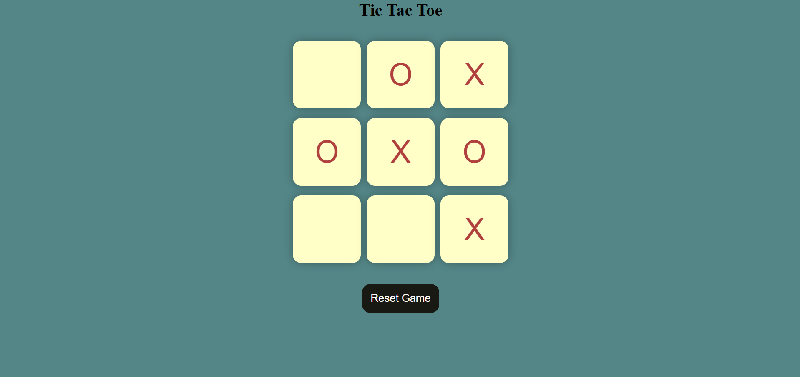

# Tic-Tac-Toe Game

This is a simple implementation of the classic Tic-Tac-Toe game using HTML, CSS, and JavaScript. The game allows two players to take turns and play on a 3x3 grid. The first player to align three of their symbols (either "X" or "O") horizontally, vertically, or diagonally wins the game. If all boxes are filled without a winner, the game ends in a draw.

## Features

- Two-player gameplay.
- Displays a congratulatory message for the winner.
- Detects a draw when all boxes are filled without a winner.
- Reset and New Game buttons to restart the game.

## Screenshot

